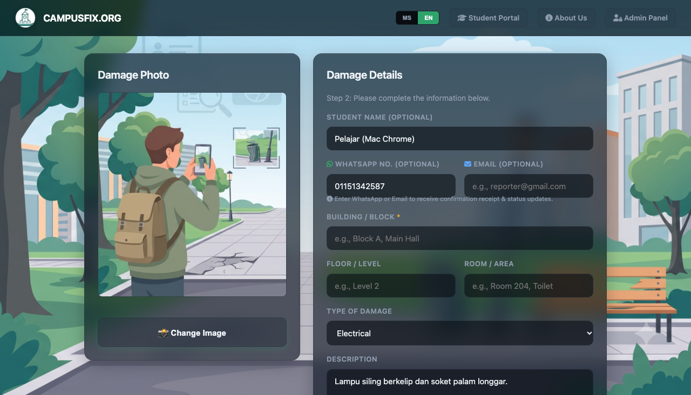
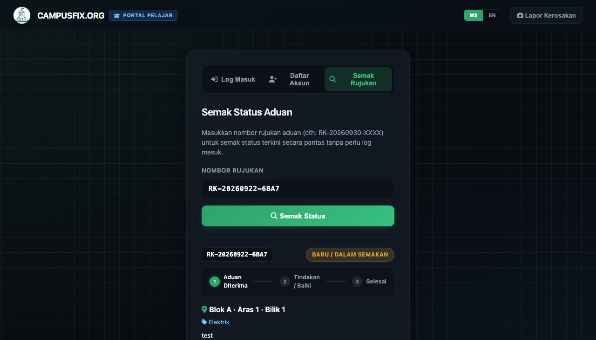
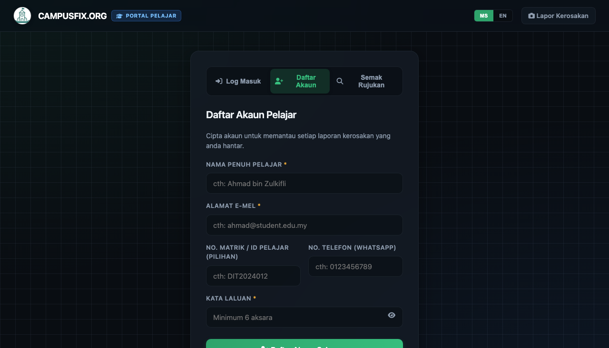
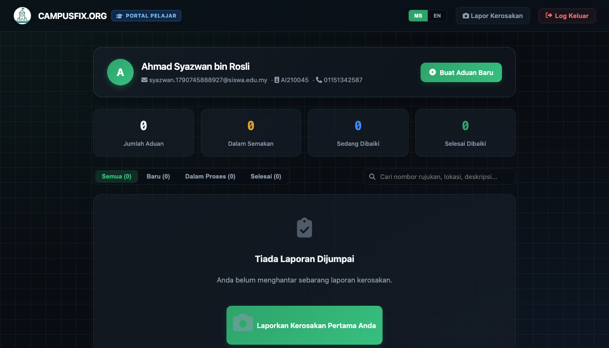
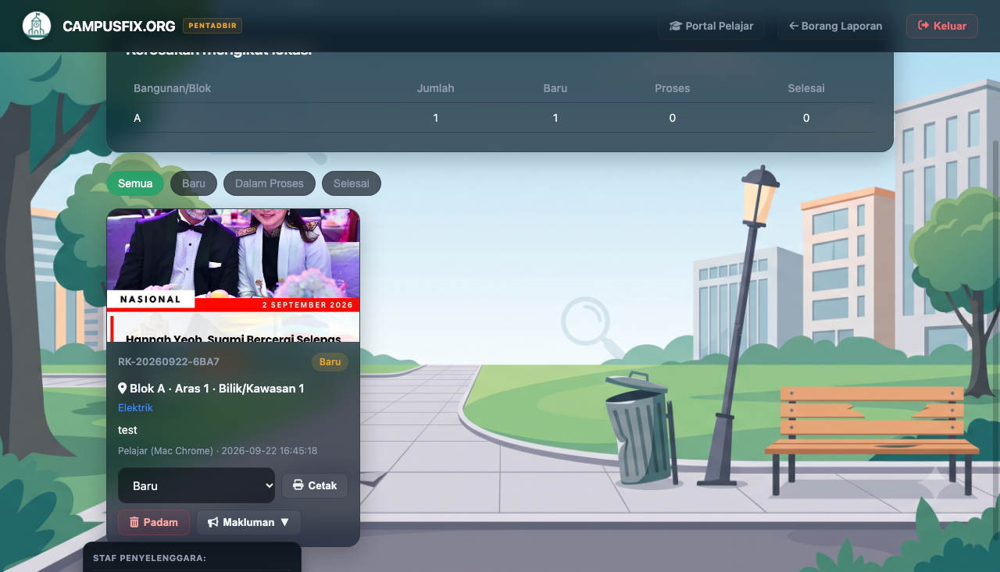
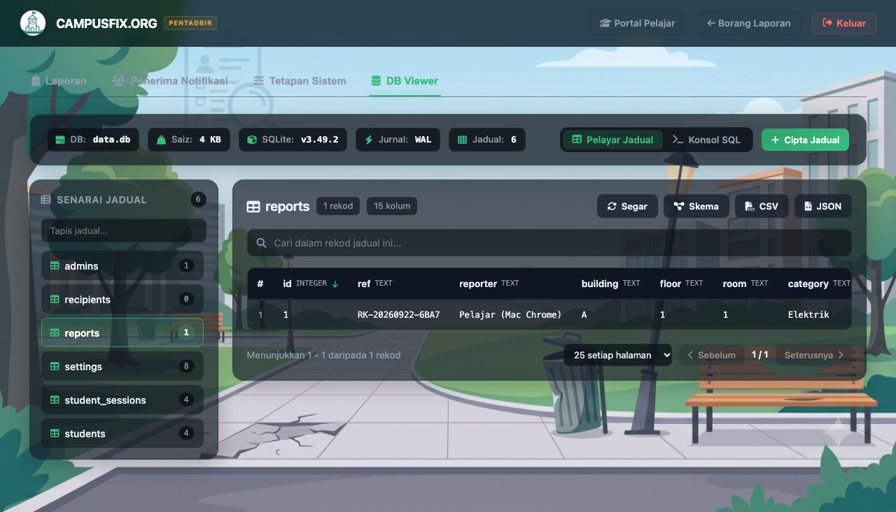
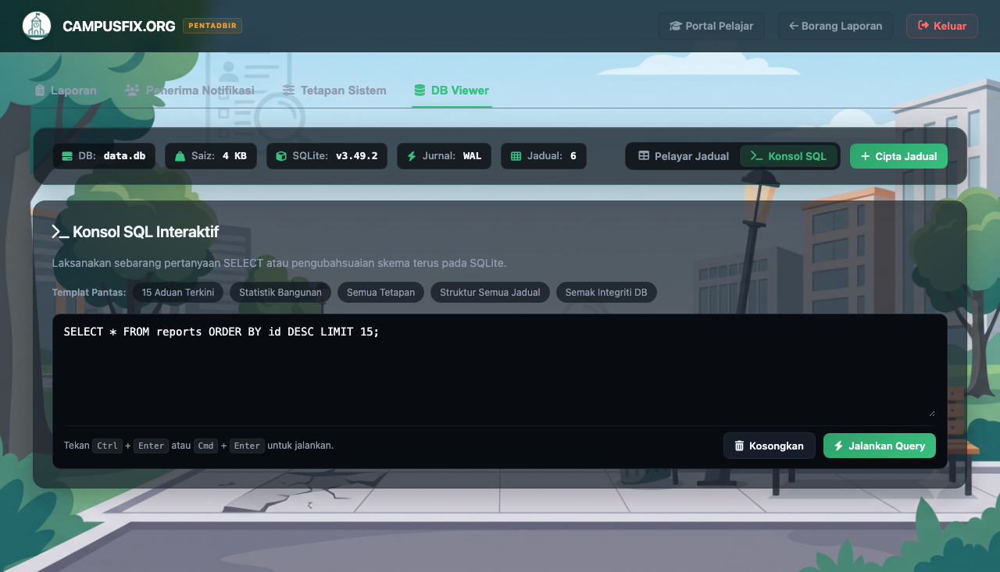

# Dokumentasi Penambahbaikan & Manual Pengguna CampusFix (RosakAlert)
**Versi Sistem:** v2.4.0  
**Tarikh Kemaskini:** 30 September 2026  
**Saluran Penggunaan:** Pengadu (Pelajar / Kakitangan) & Pentadbir (Admin / Fasiliti)  
**URL Live Pengeluaran:** [https://campusfix.org](https://campusfix.org)

---

## 📌 Pengenalan Sistem

**CampusFix (RosakAlert)** merupakan sistem pengurusan aduan kerosakan fasiliti kampus berasaskan web yang pantas, mesra mudah alih, dan responsif. Sistem ini membolehkan warga kampus membuat laporan kerosakan dengan pantas dan memudahkan pihak pentadbiran menyaring, membaiki, serta menjejak status aduan.

Dokumentasi ini merangkumi keseluruhan penambahbaikan yang telah dilaksanakan bermula daripada aliran kerja CI/CD GitHub Actions [Run #36669559621](https://github.com/akashahahamaddev/rosak-alert/actions/runs/36669559621) sehingga versi terkini yang sedang berjalan di pelayan pengeluaran.

---

## 📋 Bahagian 1: Ringkasan Log Perubahan (Changelog)

Bermula dari commit **f930832** (Run #36669559621) sehingga status terkini, empat (4) fasa penambahbaikan utama telah berjaya diuji dan dilancarkan:

| ID Komit | Perubahan Utama | Komponen Terlibat | Keterangan & Nilai Tambah |
| :--- | :--- | :--- | :--- |
| `f930832` | **Web SQLite DB Viewer & Konsol SQL** | `server.js`, `admin.html` | Membina klien pangkalan data web terbina dalam Panel Admin untuk memeriksa jadual, skema, carian baris data, dan menjalankan sebarang kueri SQL terus dari pelayar. |
| `9142b40` | **Pembaikan Paparan CSS & Cachebuster** | `admin.html`, `server.js` | Mengatasi isu caching pada proksi/Cloudflare dengan menyuntik gaya CSS terbenam (*embedded styles*) dan menambah parameter versi unik pada aset bagi memastikan paparan DB Viewer sentiasa sempurna. |
| `b1d70c0` | **Portal Akaun Pelajar & Penjejak Masa-Nyata** | `pelajar.html`, `server.js` | Membina portal khas pelajar (`/pelajar.html`) dengan pengesahan akaun (daftar, log masuk, sesi SQLite), papan pemuka aduan peribadi, dan *3-step live status stepper*. |
| `1a30363` | **Slip WhatsApp Rasmi, Sokongan Guest & Update Pengadu** | `index.html`, `pelajar.html`, `admin.html`, `server.js` | Menambah medan WhatsApp/E-mel bagi pengadu tanpa akaun (*guest*), butang "Hantar Slip ke WhatsApp Saya", simpanan sejarah tempatan peranti (*local storage*), serta butang 1-klik WhatsApp dari admin ke pengadu. |

---

## 📱 Bahagian 2: Manual Pengguna untuk Pengadu & Pelajar

Sistem kini menyediakan dua mod aduan yang sangat fleksibel:
1. **Mod Guest (Tanpa Daftar Akaun):** Pengadu boleh terus membuat aduan dalam beberapa saat tanpa memerlukan kata laluan.
2. **Mod Akaun Pelajar:** Pengadu mendaftar akaun untuk menyimpan rekod aduan secara kekal dan mengakses papan pemuka peribadi.

---

### Langkah 1: Menghantar Aduan Kerosakan (Mod Pantas / Guest)

1. Buka laman utama sistem di [https://campusfix.org](https://campusfix.org).
2. Pilih **Blok / Bangunan**, **Tingkat**, dan **Lokasi Terperinci** (contoh: Bilik Kuliah 3A, Tandas Aras 2).
3. Pilih **Kategori Kerosakan** (Elektrik, Paip, Perabot, Struktur, dll.) dan tahap kecemasan.
4. Tuliskan perincian kerosakan pada ruangan perihalan.
5. Muat naik gambar bukti kerosakan (kamera telefon atau fail galeri).
6. Masukkan **Nama Pengadu**, serta **Nombor Telefon WhatsApp** dan **E-mel**.
   > **Nota:** Nombor WhatsApp membolehkan sistem menyediakan pautan slip rasmi dan memudahkan pihak pentadbir menghubungi anda jika memerlukan maklumat tambahan.

7. Klik butang **"Hantar Aduan Sekarang"**.

---

### Langkah 2: Menyimpan Slip Rasmi WhatsApp & Sejarah Tempatan

Selepas aduan dihantar, skrin pengesahan kejayaan akan dipaparkan berserta **Nombor Rujukan Aduan** (contoh: `RK-20260922-6BA7`).

#### Tindakan yang boleh dilakukan:
1. **Salin Nombor Rujukan:** Klik butang salin di sebelah nombor rujukan untuk rujukan masa hadapan.
2. **Hantar Slip ke WhatsApp Saya:** Klik butang hijau berikon WhatsApp. Sistem akan membuka aplikasi WhatsApp anda secara automatik dengan draf slip aduan lengkap (mengandungi No. Rujukan, Lokasi, Tarikh, dan Pautan Semakan Status Langsung). Anda hanya perlu menekan *Send* untuk menyimpannya dalam perbualan peribadi anda.
3. **Rekod Peranti Tempatan (*Recent on this device*):** Sistem menyimpan nombor rujukan aduan anda pada pelayar peranti secara automatik. Anda boleh mengklik bila-bila masa untuk menyemak status terkini tanpa perlu menaip semula.

---

### Langkah 3: Menyemak Status Aduan (Tanpa Daftar Akaun)

Pengadu boleh menyemak kemajuan tindakan pembaikan pada bila-bila masa melalui portal pelajar.

1. Buka menu navigasi dan klik **"Pelajar"** atau terus ke [https://campusfix.org/pelajar.html](https://campusfix.org/pelajar.html).
2. Pastikan anda berada pada tab **"Semak Rujukan"**.
3. Masukkan Nombor Rujukan Aduan anda (contoh: `RK-20260922-6BA7`) dan klik butang **"Semak Status"**.
4. Sistem akan memaparkan status semasa dengan **Penunjuk Kemajuan 3 Peringkat (*Progress Stepper*)**:
   - **Langkah 1: Aduan Diterima** (Laporan telah masuk ke sistem pihak pengurusan).
   - **Langkah 2: Sedang Dibaiki** (Kontraktor / juruteknik sedang menjalankan kerja pembaikan).
   - **Langkah 3: Selesai** (Kerja pembaikan telah siap disahkan).

> **Tip:** Jika anda ingin berhubung dengan unit fasiliti mengenai aduan ini, klik butang **"WhatsApp Pihak Pengurusan"** yang disediakan di bawah kad laporan.

---

### Langkah 4: Mendaftar Akaun Pelajar Rasmi (Pilihan)

Jika anda adalah pelajar tetap kampus dan kerap menggunakan fasiliti, anda digalakkan mendaftar akaun rasmi untuk menghubungkan semua aduan secara automatik.

1. Pada laman `/pelajar.html`, klik tab **"Daftar Akaun"**.
2. Isikan maklumat berikut:
   - **Nama Penuh**
   - **E-mel Rasmi / Peribadi** (akan digunakan untuk log masuk)
   - **Nombor Telefon / WhatsApp**
   - **Kata Laluan** (minimum 6 aksara)
3. Klik butang **"Daftar Akaun Pelajar"**. Akaun anda akan dicipta serta-merta dan anda akan dilog masuk secara automatik.

---

### Langkah 5: Menggunakan Papan Pemuka Pelajar (Student Dashboard)

Selepas log masuk, anda akan dibawa ke **Papan Pemuka Pelajar**:

1. **Kad Ringkasan Statistik:** Memaparkan jumlah keseluruhan aduan anda, aduan dalam status *Baru*, *Sedang Dibaiki*, dan *Selesai*.
2. **Carian & Tapisan Pantas:** Cari sebarang laporan anda mengikut nombor rujukan, bangunan, atau kategori.
3. **Senarai Aduan Interaktif:**
   - Memaparkan kad aduan lengkap dengan gambar bukti, tarikh laporan, dan status berkod warna.
   - Pautan langsung untuk berkongsi status aduan atau menyalin nombor rujukan.
4. **Butang "Buat Laporan Baru":** Menghantar aduan baru di mana maklumat anda akan dihubungkan secara automatik ke profil pelajar anda.

---

## 🛠️ Bahagian 3: Manual Pengguna untuk Pentadbir (Admin)

Bagi pihak berkuasa kampus, juruteknik, dan pengurusan fasiliti, panel pentadbir telah dilengkapi dengan keupayaan automasi komunikasi dan pengurusan pangkalan data secara terus.

---

### Langkah 1: Pengurusan Aduan & Maklumat Pengadu

1. Buka laman pentadbir di [https://campusfix.org/admin.html](https://campusfix.org/admin.html) dan masukkan kata laluan keselamatan admin.
2. Pada tab **"Senarai Aduan"**, setiap kad aduan kini memaparkan lencana status pengadu:
   - **Lencana Pelajar (Biru):** Menunjukkan aduan dihantar oleh pelajar berdaftar (nama, e-mel, dan nombor telefon disahkan).
   - **Lencana Pengadu Guest (Kelabu):** Menunjukkan aduan dihantar oleh pengguna awam/tanpa akaun berserta nombor telefon atau e-mel yang dibekalkan.
3. Untuk mengemas kini status tindakan, pilih dropdown status pada kad aduan:
   - Tukar kepada **`sedang dibaiki`** apabila juruteknik telah diagihkan.
   - Tukar kepada **`selesai`** apabila kerja pembaikan telah disahkan siap sepenuhnya.

---

### Langkah 2: Ciri "Maklumkan Pengadu" (1-Klik WhatsApp Notifikasi)

Untuk memaklumkan pengadu mengenai perkembangan pembaikan tanpa perlu menaip mesej secara manual:

1. Pada kad aduan pengadu yang mempunyai nombor telefon, klik butang **"Maklumkan Pengadu"** (ikon fon telinga / mesej).
2. Sistem akan menyediakan pautan WhatsApp interaktif dengan teks rasmi yang telah diformatkan:
   - Menyatakan nombor rujukan aduan.
   - Lokasi kerosakan dan perincian.
   - Status terkini aduan (cth: "Status terkini aduan anda telah dikemas kini kepada SEDANG DIBAIKI").
   - Pautan penjejakan langsung untuk pengadu.
3. Klik **"Buka WhatsApp"** untuk terus menghantar mesej ke nombor telefon pengadu.

---

### Langkah 3: Menggunakan DB Viewer (Pelayar Pangkalan Data SQLite)

Ciri baharu **DB Viewer** membolehkan pentadbir menguruskan data SQLite sistem terus dari pelayar tanpa memerlukan pemasangan perisian luar (seperti DBeaver atau DB Browser).

1. Pada panel atas navigasi Admin, klik tab **"DB Viewer"**.
2. **Bar Maklumat Kesihatan DB:** Di bahagian atas, anda dapat melihat metrik pangkalan data secara masa-nyata:
   - Nama fail pangkalan data (cth: `data.db`).
   - Saiz storan fail pada cakera.
   - Versi enjin SQLite (cth: `v3.45.1`).
   - Mod jurnal cakera (`WAL` - Write-Ahead Logging untuk kelajuan dan keselamatan data tinggi).
   - Jumlah jadual aktif dalam sistem.

#### Fungsi-Fungsi Utama Pelayar Jadual:
- **Navigasi Jadual (Sidebar):** Klik mana-mana jadual di bar sisi kiri (`reports`, `students`, `student_sessions`, `settings`, `admins`). Bilangan baris rekod dipaparkan pada setiap lencana jadual.
- **Carian Segera (*Instant Search*):** Taip sebarang kata kunci pada kotak carian untuk menapis baris rekod mengikut nama, teks, atau ID.
- **Penomboran Halaman & Had Baris:** Pilih untuk memaparkan 25, 50, atau 100 baris bagi setiap halaman.
- **Perlindungan Hash Kata Laluan (*Password Masking*):** Medan kata laluan disembunyikan secara lalai (`••••••••`). Klik ikon mata untuk mendedahkan nilai hash jika diperlukan bagi tujuan audit keselamatan.
- **Pautan Papar Foto:** Klik pautan foto kerosakan untuk membuka fail imej asal dalam tab baharu.
- **Eksport Data:** Klik butang **"Eksport"** untuk memuat turun data jadual semasa ke format fail **CSV** atau **JSON**.
- **Pemeriksa Skema (*Schema Drawer*):** Klik butang "Skema" untuk melihat struktur kolum, jenis data (`INTEGER`, `TEXT`, dsb.), dan kekunci utama (*Primary Key*).

---

### Langkah 4: Menggunakan Konsol Pertanyaan SQL Interaktif

Bagi analisis data mendalam atau penyelenggaraan khas, pentadbir boleh menggunakan **Konsol SQL Interaktif**.

1. Di dalam tab DB Viewer, klik sub-butang **"Konsol SQL"**.
2. **Templat Pantas (*SQL Presets*):** Klik mana-mana templat siap sedia untuk memasukkan kueri lazim secara automatik:
   - *15 Aduan Terkini*
   - *Statistik Bangunan* (mengira jumlah kerosakan dan kadar selesai bagi setiap blok)
   - *Semua Tetapan*
   - *Struktur Semua Jadual*
   - *Semak Integriti DB* (`PRAGMA integrity_check`)
3. **Editor Kueri SQL:** Taip sebarang pertanyaan kustom (contoh: `SELECT building, COUNT(*) FROM reports GROUP BY building;`).
4. **Pintasan Papan Kekunci:** Tekan <kbd>Ctrl</kbd> + <kbd>Enter</kbd> (atau <kbd>Cmd</kbd> + <kbd>Enter</kbd> pada Mac) atau klik butang hijau **"Jalankan SQL"**.
5. **Jadual Keputusan Dinamik:** Keputusan kueri akan dipaparkan serta-merta berserta kiraan jumlah baris yang terjejas dan tempoh masa pelaksanaan kueri (dalam milisaat).

---

## 🔒 Bahagian 4: Spesifikasi Teknikal & Keselamatan Sistem

Bagi rujukan pasukan teknikal dan DevOps:

1. **Struktur Skema Pangkalan Data:**
   - Kolum baharu pada jadual `reports`:
     - `student_id` (`INTEGER NULL`): Menghubungkan aduan kepada akaun pelajar jika dilog masuk.
     - `reporter_phone` (`TEXT NULL`): Nombor telefon pengadu untuk komunikasi pantas.
     - `reporter_email` (`TEXT NULL`): E-mel pengadu untuk notifikasi dan semakan.
   - Jadual baharu `students`: Menyimpan rekod pelajar berdaftar (`id`, `name`, `email`, `phone`, `password_hash`, `created_at`).
   - Jadual baharu `student_sessions`: Menguruskan token sesi pengesahan berasaskan kuki `HttpOnly`.

2. **Senarai Endpoint API Baharu:**
   - `POST /api/student/register`: Pendaftaran akaun pelajar baharu.
   - `POST /api/student/login`: Pengesahan log masuk dan pengeluaran token sesi.
   - `POST /api/student/logout`: Membatalkan sesi aktif.
   - `GET /api/student/me`: Mengambil profil pelajar semasa dan senarai aduan milik pelajar.
   - `GET /api/reports/track/:ref`: Mengambil status dan sejarah kemajuan aduan tanpa mengira status log masuk (awam).
   - `GET /api/db/overview`: Metrik pangkalan data SQLite (saiz, versi, mod jurnal, senarai jadual).
   - `GET /api/db/table/:name`: Melayari baris data jadual berserta penapisan dan penomboran halaman.
   - `POST /api/db/query`: Melaksanakan kueri SQL tersuai (dilindungi kata laluan admin).
   - `POST /api/db/create-table`: Mencipta jadual baharu melalui borang antara muka pengguna.

3. **Integriti & Sandaran Data (*Backup*):**
   - Fail pangkalan data disimpan di `data.db` dalam direktori pelayan.
   - Penggunaan mod `WAL` memastikan sistem mampu menangani operasi baca/tulis (*concurrent read/write*) yang tinggi tanpa berlaku konflik (*database locked*).

---

*Dokumentasi ini dijana dan disahkan selaras dengan binaan pengeluaran terkini CampusFix (RosakAlert).*
